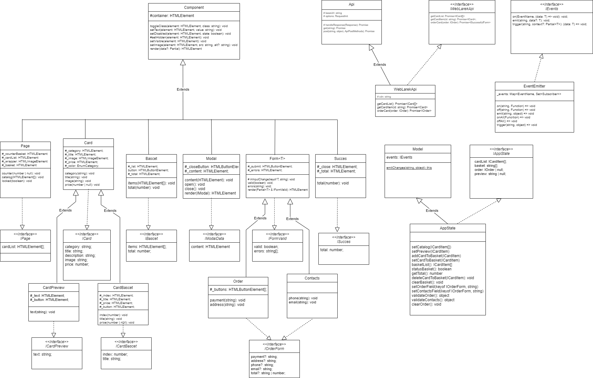

# Проектная работа "Веб-ларек"

Стек: HTML, SCSS, TS, Webpack

Структура проекта:
- src/ — исходные файлы проекта
- src/components/ — папка с JS компонентами
- src/components/base/ — папка с базовым кодом

Важные файлы:
- src/pages/index.html — HTML-файл главной страницы
- src/types/index.ts — файл с типами
- src/index.ts — точка входа приложения
- src/scss/styles.scss — корневой файл стилей
- src/utils/constants.ts — файл с константами
- src/utils/utils.ts — файл с утилитами

## Установка и запуск
Для установки и запуска проекта необходимо выполнить команды

```
npm install
npm run start
```

или

```
yarn
yarn start
```
## Сборка

```
npm run build
```

или

```
yarn build
```

## Описание основных данных

Карточка товара

```
export interface ICard {
   id: string;
   description: string;
   image: string;
   title: string;
   category: string;
   price: number | null;
}

```

Перечисление категорий карточек

```
export enum CardCategory {
    soft =  "софт-скил",
    other = "другое",
    additional = "дополнительное",
    button = "кнопка",
    hard = "хард-скил"
}
```

Корзина

```
export interface IBasket {
	items: string[];
	total: number;
}
```

Модель для хранения данных карточек товара

```
export interface ICardList {    
    items: ICard[];
}
```

Интерфейс заказ

```
export interface IOrder {
	payment: string;
	email: string;
	phone: string;
	address: string;
	items: string[];
	total: number;
}
```

Тип формы заказа

```
export type TOrderForm = Omit<IOrder, 'total' | 'items'>;
```

## Архитектура приложения

Код приложения разделен на слои согласно парадигме MVP: 
- слой представления, отвечает за отображение данных на странице, 
- слой данных, отвечает за хранение и изменение данных
- презентер, отвечает за связь представления и данных.



### Базовый код

#### Класс Api
Содержит в себе базовую логику отправки запросов. В конструктор передается базовый адрес сервера и опциональный объект с заголовками запросов.
Методы: 
- `get` - выполняет GET запрос на переданный в параметрах ендпоинт и возвращает промис с объектом, которым ответил сервер
- `post` - принимает объект с данными, которые будут переданы в JSON в теле запроса, и отправляет эти данные на ендпоинт переданный как параметр при вызове метода. По умолчанию выполняется `POST` запрос, но метод запроса может быть переопределен заданием третьего параметра при вызове.

#### Класс EventEmitter
Брокер событий позволяет отправлять события и подписываться на события, происходящие в системе. Класс используется в презентере для обработки событий и в слоях приложения для генерации событий.  
Основные методы, реализуемые классом описаны интерфейсом `IEvents`:
- `on` - подписка на событие
- `emit` - инициализация события
- `trigger` - возвращает функцию, при вызове которой инициализируется требуемое в параметрах событие   

#### Класс Component
Абстрактный класс компонентов представления (Наследуется всеми классами представления View). Предназначен для создания компонентов UI:

- Page;
- Card;
- Basket;
- Modal;
- Form;
- Success;

Свойства:
readonly корневой DOM-элемент: HTMLElement — корневой DOM-элемент
Конструктор принимает элемент контейнера, в котором разместится сам компонент:\
constructor(readonly container: HTMLElement) 

Методы:
- toggleClass(element: HTMLElement, class: string) - Переключение класса;
- setText(element: HTMLElement, value: string) — Установление текстового содержимого;
- setDisabled(element: HTMLElement, state: boolean) — Изменение статуса блокировки;
- protected setHidden(element: HTMLElement) — Скрытие элемента;
- setVisible(element: HTMLElement) — Показ элемента;
- setImage(element: HTMLElement, src: string, alt?: string) — Установить изображение с альтернативным текстом;
- render(data?: Partial) — возвращает корневой DOM элемент.

### Слой данных

#### Класс Model
Абстрактный класс для создания модели данных. Т.к. он абстрактный, то его экземпляры не создаются напрямую. Он служит базовым для других классов, которые его наследуют, расширяя функциональность, определенную в этом классе. Его наследником является класс AppState.

Конструктор класса с исходными данными, которые будут установлены в класс и событие для того, чтоб можно было уведомлять вес окружающий код о том, что событие произошло:\
`constructor(data: Partial, events: IEvenets)` — принимает частичные данные типа T и объект событий IEvents. Частичные данные T представляют структуру данных, которая может быть использована для инициализации экземпляра класса. Объект IEvents содержит определения различных событий, которые могут быть сгенерированы и обработаны внутри класса.

Метод `emitChanges` сообщает, что модель изменилась:\
`emitChanges(event: string, payload?: object)` — запускает событие с переданным названием и данными, уведомляя подписчиков в изменении модели
Т.е. метод emitChanges запускает соответствующее событие из объекта events, что позволяет другим частям кода слушать эти события и реагировать на них. Таким образом, класс Model предоставляет основной шаблон для создания моделей данных, которые могут инициализироваться, управлять событиями и обеспечивать базовую абстракцию для работы с данными в приложении.


#### Класс AppState
Наследуется от класса Model. Класс представляет хранилище данных приложения. Он содержит информацию о списках карточек, корзине, предпросмотре товара, заказе и ошибках формы заказа. Содержит методы для управления данными через события. Конструктор класса принимает объект событий events. 

```
interface IAppState {
   cardList: ICardItem[];
   basket: string[];
   order: IOrder | null;
   preview: string | null;
   formErrors: FormErrors;
}
```

Поля:

- _cardList - ICardItem[];\
- _basket- ICardItem[];\
- _order- IOrder;\
- _preview- string | null;\
- _formErrors- FormErrors;

Имеет методы:

- setCatalog - Устанавливает список карточек и генерирует событие изменения списка.
- setPreview - Устанавливает предпросмотр карточек и генерирует событие изменения предпросмотра.
- basketList - вернуть список товара в корзине.
- addToBasket - добавляет товар в заказ.
- setToBasket - добавляет товар в корзину и генерирует событие изменения корзины.
- statusBasket - вернуть информацию по составу в корзине.
- deleteCardToBasket - удалить товар из корзины корзины и генерирует событие изменения корзины.
- getTotal - вернуть общую сумму заказов.
- setOrderField - Вывести данные введенные в поле доставки.
- setContactsField - Вывести данные введенные в поле контакты.
- validateOrder - Валидация введенных данных заказа и генерирует событие изменения ошибок формы заказа.
- validateContacts - Валидация введенных формы котактов.
- clearOrder - отчистка заказа.

```
interface ICardItem {
    id: string;
    title: string;
    description: string;
    category: string;
    image: string;
    price: number | null;
}
```

### Классы представления
Все классы представления отвечают за отображение внутри контейнера (DOM-элемент) передаваемых в них данных.

#### Класс Page - формирование главной страницы.

   ```
   interface IPage {
      cardList: HTMLElement[];
   }
   ```
   Имеет следующие поля и методы:

   **Поля:**

   - ``_counterBasket`` - HTMLElement;
   - ``_cardList``- HTMLElement;
   - ``_wrapper``- HTMLImageElement;
   - ``_basket``- HTMLElement;
   
   **Конструктор:**

   constructor(container: HTMLElement, events: IEvents)

   **Методы:**

   - ``set counter(value: number | null)`` - изменить счетчик товара в корзине на главной странице.
   - ``set catalog(items: HTMLElement[])`` - вывести список карточек.
   - ``set locked(value: boolean)`` - установка или снятие блока прокрутки страницы.

#### Класс Card - описание карточки товара. Наследуется от класса Component. Имеет двух наследников CardPreview и CardBasket

   ```
   interface ICard {
	   category: string;
	   title: string;
	   description: string;
	   image: string;
	   price: number;
   }
   ```

   Имеет следующие поля и методы:

   **Поля:**

   - ``_category`` - HTMLElement;
   - ``_title``- HTMLElement;
   - ``_image``- HTMLImageElement;
   - ``_price``- HTMLElement;
   - ``_colors``- <Record<string, string>>;

    **Конструктор:**

   constructor(container: HTMLElement, actions?: IActions)

   **Методы:**

   - ``set category(value: string)`` - принимает строку с сервера, устанавливает категорию.
   - ``set title(value: string)`` - принимает строку с сервера, устанавливает заголовок.
   - ``set image(value: string)`` - принимает строку с сервера, устанавливает изображение.
   - ``set price(value: number)`` - принимает номер с сервера, устанавливает цену.

#### Класс CardPreview - описание карточки товара в превью  . Наследуется от класса Card.

   ```
   interface ICardPreview {
	   text: string;
   }  
   ```

   Имеет следующие поля и методы:

   **Поля:**

   - ``_text`` - HTMLElement;
   - ``_button``- HTMLElement;

   **Конструктор:**

   constructor(container: HTMLElement, actions?: IActions)

   **Методы:**

   - ``set text(value: string)`` - принимает строку с сервера, устанавливает текст.

#### Класс CardBasket - описание карточки товара в превью. Наследуется от класса Card.

   ```
   interface ICardBasket {
	   index: number;
	   title: string;
	   price: number;
   }   
   ```

   Имеет следующие поля и методы:

   **Поля:**

   - ``_index`` - HTMLElement;
   - ``_title`` - HTMLElement;
   - ``_price`` - HTMLElement;
   - ``_button`` - HTMLElement;

   **Конструктор:**

   constructor(container: HTMLElement, actions?: IActions)

   **Методы:**

   - ``set index(value: number)`` - принимает номер, устанавливает индекс.
   - ``set title(value: string)`` - принимает строку, устанавливает текст.
   - ``set price(value: number | null)`` - принимает номер, устанавливает цену.


#### Класс Basket - описание корзины. Наследует класс Component

   ```
   interface IBasket {
	   items: HTMLElement[];
	   total: number;
   }
   ```

   Имеет следующие поля и методы:

   **Поля:**

   - ``_list`` - HTMLElement;
   - ``button``- HTMLButtonElement;;
   - ``_total``- HTMLElement;

   **Конструктор:**

   constructor(container: HTMLElement, events: EventEmitter)

   **Методы:**

   - ``set items(items: HTMLElement[])`` - вставить данные в корзину.
   - ``set total(price: number)`` - посчитать общую стоимость товара.


#### Класс Form<T> - класс для работы с формами. Наследуется от класса Component. Имеет двух наследников Order и Contacts

   ```
   interface IFormValid {
	   valid: boolean;
	   errors: string[];
   }
   ```

   Имеет следующие поля и методы:

   **Поля:**

   - ``_submit`` - HTMLButtonElement;
   - ``_errors``- HTMLElement;

   **Конструктор:**

   constructor(protected container: HTMLFormElement, protected events: IEvents)

   **Методы:**

   - ``InInputChange`` -обработчик событий ввода.
   - ``set valid`` - контролирует активность кнопки отправки в зависимости от валидности формы.
   - ``set errors`` - устанавливает и отображает ошибки валидации формы.
   - ``render`` - показывает состояние формы.

 #### Класс Order - отображение модального окна заполнения адреса. Наследуется от класса Form

   ```
   interface IOrderForm {
	   payment?: string;
	   address?: string;
	   phone?: string;
	   email?: string;
	   total?: string | number;
   }
   ```

   Имеет следующие поля и методы:

   **Поля:**

   - ``_buttons`` - HTMLButtonElement;

   **Конструктор:**

   constructor(container: HTMLFormElement, events: IEvents)

   **Методы:**

   - ``set payment(name: string)`` - переключение между кнопками.
   - ``set address`` - ввод адреса доставки.
     
 #### Класс Contacts - отображение модального окна заполнения почты и телефона. Наследуется от  класса Form

   ```
   interface IOrderForm {
	   payment?: string;
	   address?: string;
	   phone?: string;
	   email?: string;
	   total?: string | number;
   }   
   ```

   **Конструктор:**

   constructor(container: HTMLFormElement, events: IEvents)

   **Методы:**

   - ``set phone`` - ввод телефона.
   - ``set email`` - ввод почты.

#### Класс Success - отображение модального удачного заказа. Наследуется от  класс Component

   ```
   interface ISuccess {
	   total: number;
   }
   ```

   ```
   interface ISuccessActions {
	   onClick: () => void;
   }
   ```
   Имеет следующие поля и методы:

   **Поля:**

   - ``_close`` -  HTMLElement;
   - ``_total``- HTMLElement;

   **Конструктор:**

   constructor(container: HTMLElement, actions: ISuccessActions)

   **Методы:**

   - ``set total`` - устанавливет текст в элемент. 

#### Класс Modal - класс для работы с модальным окном. Наследуется от класса Component

   ```
   interface IModalData {
	   content: HTMLElement;
   }
   ```

   Имеет следующие поля и методы:
   
   **Поля:**

   - ``_closeButton`` -  HTMLButtonElement;
   - ``_content``- HTMLElement;

   **Конструктор:**

   constructor(container: HTMLElement, events: IEvents)

   **Методы:**

   - ``set content`` - определяет контент показа в модальном окне.
   - ``open`` - открывает модальное окно.
   - ``close`` - закрывает модальное окно.
   - ``render`` - рендерит модальное окно.

### Слой коммуникации

#### Класс WebLarekAPI implements IWebLarekAPI

Расширяет класс Api и реализует интерфейс IWebLarekAPI. 
Конструктор принимает URL адрес cdn, базовый URL адрес baseUrl и опции запроса options.
Содержит методы для взаимодействия с веб-API.
В конструкторе вызывается конструктор родительского класса Api с переданными параметрами.
constructor(cdn: string, baseUrl: string, options?: RequestInit)

Методы:

- getCardList(): Promise<ICard[]> - Выполняет запрос для получения списка всех карточек с сервера
- getCardItem(id: string): Promise<ICard> - Выполняет запрос для получение данных карточки по id
- orderCard(order: IOrder): Promise<IOrderResult> - Выполняет запрос на оформление возврат данных по заказу


## Взаимодействие компонентов
Код, описывающий взаимодействие представления и данных между собой находится в файле `index.ts`, выполняющем роль презентера.\
Взаимодействие осуществляется за счет событий генерируемых с помощью брокера событий и обработчиков этих событий, описанных в `index.ts`\
В `index.ts` сначала создаются экземпляры всех необходимых классов, а затем настраивается обработка событий.

*Список всех событий, которые могут генерироваться в системе:*\
*События изменения данных (генерируются классами моделями данных)*
- items:change - Вызывается при изменении списка товаров. Внутри обработчика каждый товар из списка преобразуется в карточку товара, используя шаблон 'cardCatalogTemplate'. Обработчик клика на карточке устанавливается для передачи события 'card:select' с данными о выбранном товаре. Полученные карточки товаров затем сохраняются в свойстве 'catalog' объекта 'page'.
-preview:change - Вызывается при изменении предварительного просмотра товара. Внутри обработчика создается карточка товара на основе шаблона предварительного просмотра. Обработчик клика на карточке устанавливается для добавления или удаления товара из корзины и соответствующего изменения текста кнопки. После этого карточка товара рендерится и передается для отображения в содержимом модального окна, которое затем открывается.
- basket:change - Вызывается при изменении содержимого корзины. Внутри обработчика обновляется счетчик товаров на странице, список товаров в корзине и общая сумма товаров. Каждый товар в корзине представляется в виде карточки товара, для которой устанавливается обработчик клика для удаления товара из корзины.
- formErrors:change - Вызывается при изменении ошибок в форме. Внутри обработчика извлекаются ошибки для различных полей формы, таких как оплата, адрес, электронная почта и телефон. Затем обновляются состояния валидности формы оформления заказа и контактной информации на основе наличия ошибок.

*События, возникающие при взаимодействии пользователя с интерфейсом (генерируются классами, отвечающими за представление)*
- modal:open - Вызывается при открытии модального окна. Внутри обработчика устанавливается значение свойства 'locked' объекта 'page' в 'true'.
- modal:close - Вызывается при закрытии модального окна. Внутри обработчика устанавливается значение свойства 'locked' объекта 'page' в 'false'.
- card:select - Вызывается при нажатии карточки товара. Внутри обработчика вызывается метод 'setPreview' объекта 'appData' с передачей выбранного товара.
- basket:open - Вызывается при открытии корзины. Внутри обработчика происходит рендеринг содержимого корзины и передача его для отображения в модальном окне, после чего модальное окно открывается.
- order:open - Вызывается при открытии оформления заказа. Внутри обработчика происходит рендеринг содержимого формы оформления заказа с начальными значениями, такими как метод оплаты, адрес доставки, состояние валидности формы и список ошибок. После этого модальное окно открывается для отображения формы оформления заказа.
- order.*:change - При срабатывании события вызывается функция, которая устанавливает новое значение для указанного поля в форме оформления заказа.
- contacts.*:change - При срабатывании события вызывается функция, которая устанавливает новое значение для указанного поля в форме оформления заказа.
- order:submit - Вызывается при нажатии кнопки продолжения заполнения заказа. Внутри обработчика происходит рендеринг содержимого формы контактной информации с начальными значениями, такими как номер телефона, электронная почта, состояние валидности формы и список ошибок. После этого модальное окно открывается для отображения формы контактной информации.
- contacts:submit - Вызывается при отправке контактной информации. Внутри обработчика отправляются данные заказа на сервер через API. При успешном оформлении заказа создается сообщение об успешном оформлении заказа, которое отображается в модальном окне. После закрытия модального окна происходит очистка корзины и обновление содержимого корзины. Если возникают ошибки при отправке заказа, они выводятся в консоль.


